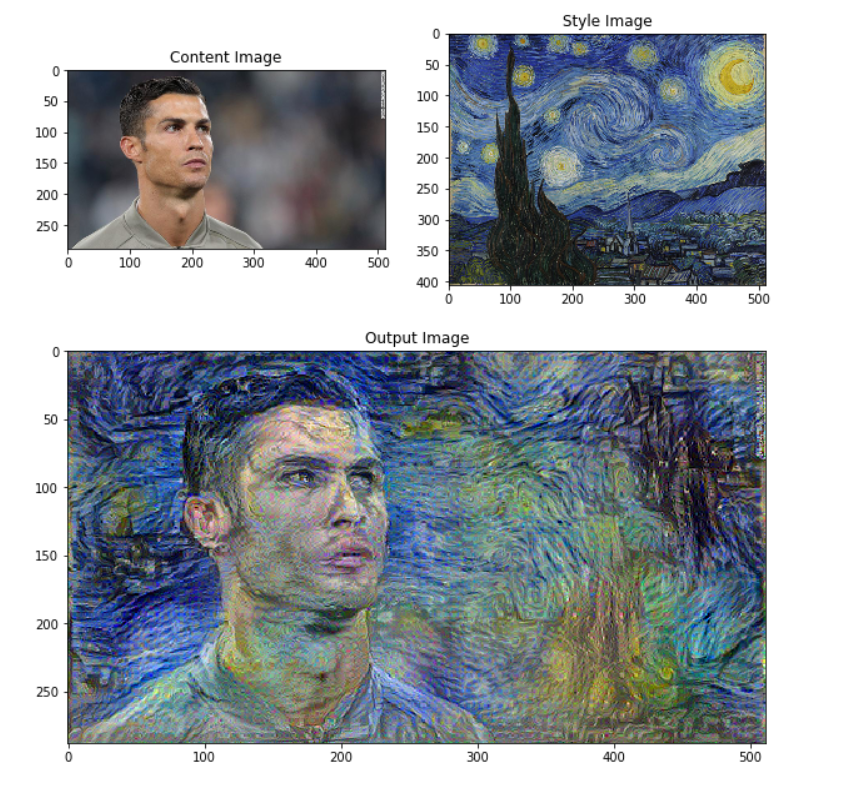

# Neural-Style-Transfer

Neural Style Transfer is a technique that takes three images: **content image**, **style image**, **input image**. It blends the content details of the content image and the style details of the style image and transforms the input image to look like the content image styled with the style image.
  
When implemented it produces a result as shown below, where the content and the style images represent the input and the following image, the output.  
  

  
* The application is implemented using Tensorflow and Keras along with the supporting libraries and uses the VGG19 model, for generating the feature representations.
  
* The input images (both content and style) are included under the directory "/tmp/nst"  
  
* The outputs generated for various combinations of content and style images in "/tmp/nst" are stored in the outputs directory.  
  
**requirements.txt**
  
* ipython==7.5.0  
* jupyter==1.0.0  
* Keras-Applications==1.0.7  
* Keras-Preprocessing==1.0.9  
* matplotlib==3.0.3  
* numpy==1.16.3  
* Pillow==6.0.0  
* tensorflow==1.13.1  
